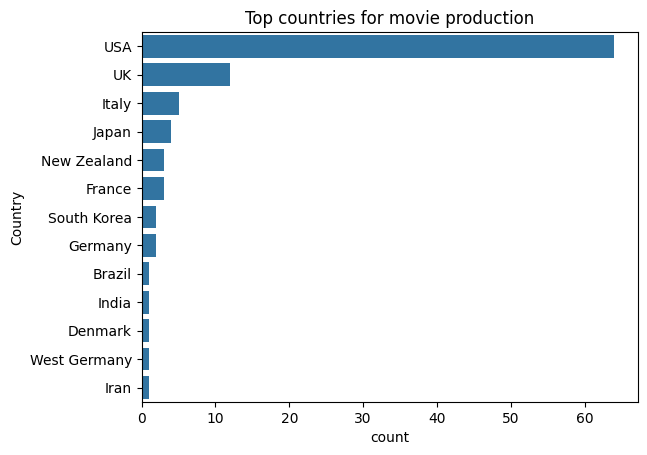
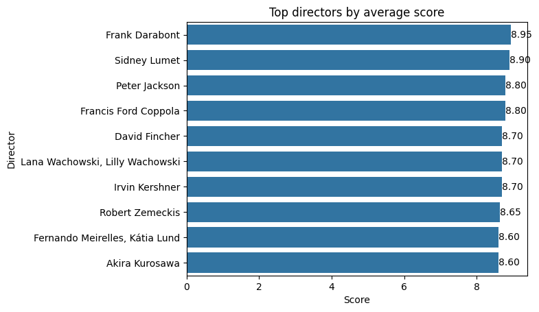
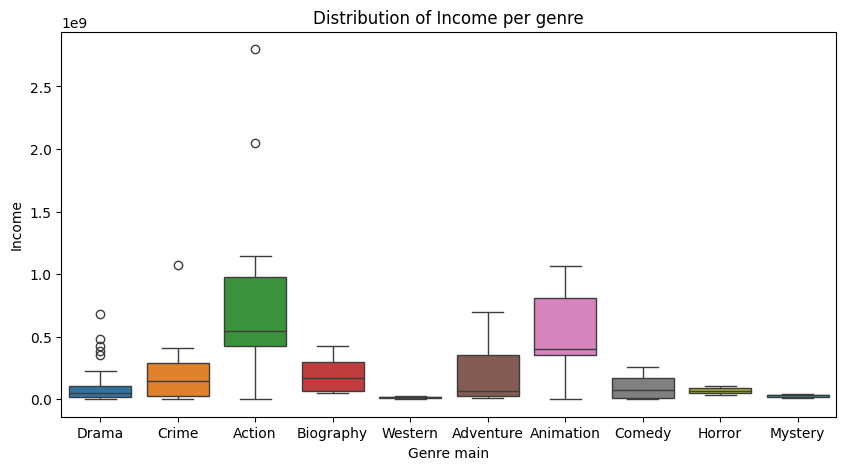
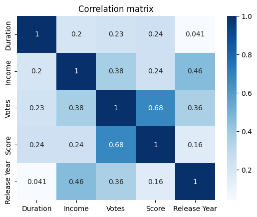

# IMDB Data Cleaning & Exploratory Data Analysis

This project focuses on cleaning and analyzing an intentionally corrupted IMDB dataset.

The goal was to identify and resolve data quality issues such as invalid numeric values, inconsistent date formats, encoding problems and missing values before performing an exploratory data analysis using Pandas and Seaborn.

## Dataset
The dataset contains information about 100 highly rated movies, including:

- Title
- Release Date
- Director
- Country
- Duration
- Income
- Votes
- Score
- Content Rating

## Data Cleaning

The dataset contained several intentionally introduced issues:

- Invalid numeric values
- Inconsistent date formats
- Country naming inconsistencies
- Character encoding errors
- Missing values
- Incorrect income records
 
The following techniques were applied:
 
- String cleaning with 
- Datatype conversion
- Date standardization
- Category normalization
- Manual validation of corrupted income values

Many validations have been done after data cleaning, below two examples with sns.boxplot for the votes and sns.histplot for the income.

## Exploratory Data Analysis (EDA)

Examples of the insights found:

### Top countries by movie

### Top directors by average score

### Correlation between votes and score

### Distribution of income per genre

### Correlation matrix bewtween numerical entries

